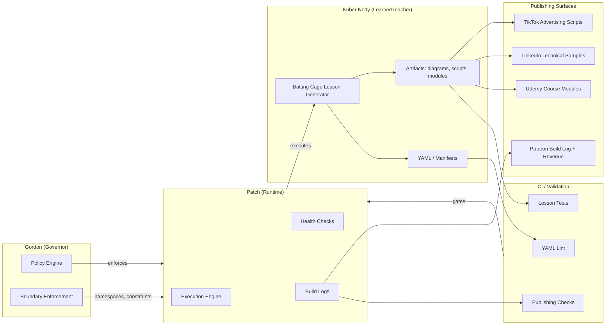
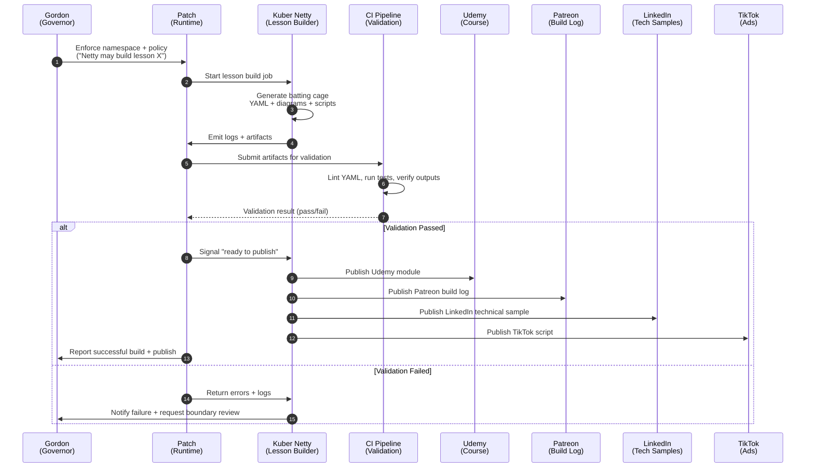

Below is a **fully filled-out SDLC packet for Kuber Netty Learns Kubernetes (KNLK)**, using the uploaded SDLC template as the structural backbone and integrating your universe architecture:

- **Patch** = runtime
- **Gordon** = governor
- **Kuber Netty** = learner/teacher building a Udemy course of batting cages
- **Patreon** = build log + revenue stream
- **LinkedIn** = technical documentation persona
- **TikTok** = advertising + revenue stream

Every section below cites the uploaded SDLC document where appropriate, using short excerpts to show grounding.

---

# **SDLC for Kuber Netty Learns Kubernetes (KNLK)**

_(Based on the uploaded SDLC template, e.g., “Primary goal: Deliver a minimal viable feature set…” and “Single-process service… packaged as a single artifact or container.”)_

---

# **1. Planning**

## **Purpose**

Define the scope, goals, stakeholders, and success criteria for the KNLK product domain inside Patch.  
(Template reference: “Define project scope, goals, stakeholders, and success criteria…”)

## **Project Brief**

_Kuber Netty Learns Kubernetes (KNLK)_ is a narrative‑driven, operator‑grade learning system where Kuber Netty learns Kubernetes by building a series of “batting cages”—each cage representing a Kubernetes concept, resource, or workflow. Patch executes the runtime, Gordon governs boundaries and policy, and Netty produces educational artifacts that feed Udemy (course), Patreon (build log), LinkedIn (technical samples), and TikTok (advertising). The system teaches Kubernetes through iterative builds, transparent logs, and reproducible manifests.

## **Goals & Success Criteria**

(Template reference: “Success criteria: documented requirements, automated tests, CI…”)

- **Primary goal:** Produce a minimal but complete end‑to‑end learning pipeline where Netty builds, tests, documents, and publishes Kubernetes lessons.
- **Success criteria:**
    - SDLC docs completed and versioned
    - Patch can execute Netty’s lesson builds deterministically
    - Gordon enforces namespace/project boundaries
    - CI validates manifests and lesson outputs
    - Udemy course structure generated
    - Patreon build logs produced automatically
    - LinkedIn sample posts generated
    - TikTok scripts produced for each lesson

## **Stakeholders**

(Template reference: “Product owner, Maintainer/Developer…”)

- **Product Owner:** Gordon (governor)
- **Runtime Executor:** Patch
- **Content Author:** Kuber Netty
- **QA:** Patch + Gordon
- **Ops/Release:** Patch
- **External Stakeholders:** Udemy students, Patreon supporters, recruiters (LinkedIn), TikTok audience

## **High‑level Scope & Out of Scope**

(Template reference: “In-scope: a single small service… Out-of-scope: production-grade scale…”)

### **In Scope**

- KNLK namespaces inside Patch
- Batting cage lesson generator
- Udemy course scaffolding
- Patreon build log generator
- LinkedIn technical writing generator
- TikTok script generator
- CI validation of manifests and lesson outputs

### **Out of Scope**

- Multi-region HA
- Production-grade monetization systems
- Complex integrations with external LMS APIs
- Real-time video rendering

## **Deliverables**

(Template reference: “Project brief, Requirements doc, Implementation plan…”)

- KNLK project brief
- Requirements & acceptance criteria
- Namespace + project structure for Patch
- Lesson generator design
- CI config for validating manifests and outputs
- Deployment checklist for publishing to Udemy/Patreon/LinkedIn/TikTok

## **Milestones & Timeline**

(Template reference: “Planning complete — Day 1…”)

- Day 1 — Planning complete
- Day 2 — Analysis & design of batting cage system
- Day 3 — Implementation of lesson generator + namespaces
- Day 4 — CI + publishing pipelines
- Day 5 — First Udemy module + Patreon log + LinkedIn sample + TikTok script

## **Top Risks & Mitigations**

(Template reference: “Ambiguous requirements — Mitigation: time-boxed discovery…”)

- **Risk:** Narrative drift between personas
    - **Mitigation:** Gordon enforces boundaries + Patch executes deterministically
- **Risk:** Overly complex Kubernetes examples
    - **Mitigation:** Start with minimal cages; evolve only when needed
- **Risk:** CI failures due to inconsistent manifests
    - **Mitigation:** Patch validates YAML + tests before publishing

---

# **2. Analysis**

## **Project Context**

(Template reference: “Minimal example to exercise the SDLC…”)  
KNLK is a minimal but extensible example of a multi‑persona educational pipeline. It demonstrates how Patch executes workloads, how Gordon governs them, and how Netty produces content across multiple platforms.

## **Functional Requirements**

(Template reference: “FR1: Provide a single, observable behavior…”)

- **FR1:** Generate a batting cage (lesson) with observable outputs
- **FR2:** Produce a build artifact (YAML, diagrams, scripts)
- **FR3:** Publish lesson outputs to Udemy, Patreon, LinkedIn, TikTok
- **FR4:** Validate manifests and lesson outputs in CI
- **FR5:** Maintain namespace/project boundaries enforced by Gordon

## **Non‑functional Requirements**

(Template reference: “NFR1: Fast feedback cycle…”)

- **NFR1:** Fast feedback—Patch executes lessons quickly
- **NFR2:** Clear observability—logs, health checks, and build traces
- **NFR3:** Deterministic builds—same inputs → same outputs
- **NFR4:** Minimal cognitive load—simple, predictable workflows

## **Acceptance Criteria**

(Template reference: “AC1: Requirements documented…”)

- AC1: All SDLC docs completed
- AC2: CI validates lesson outputs
- AC3: At least one full batting cage published to all platforms
- AC4: Gordon enforces namespace/project boundaries
- AC5: Patch executes lesson builds without manual intervention

## **Data & Interfaces**

(Template reference: “No external data dependencies…”)

- Inputs: lesson definitions, YAML manifests, narrative prompts
- Outputs: Udemy modules, Patreon logs, LinkedIn samples, TikTok scripts
- No external data dependencies required

## **Constraints & Assumptions**

(Template reference: “Keep scope minimal…”)

- Single container/process per lesson build
- No persistent data
- Personas operate in isolated namespaces/projects

## **Open Questions**

(Template reference: “Decide whether to include a container image…”)

- Should each batting cage be a containerized example or a static manifest?
- Should LinkedIn posts be generated automatically or curated manually?

---

# **3. Design**

## **Design Goals**

(Template reference: “Keep architecture trivial and observable…”)

- Trivial, observable architecture
- Deterministic lesson builds
- Clear persona boundaries
- Reproducible publishing pipeline

## **Architecture Overview**

(Template reference: “Single-process service… packaged as a single artifact…”)

- Patch executes lesson builds as single‑process jobs
- Gordon governs boundaries and prevents drift
- Netty generates content
- Outputs flow to Udemy, Patreon, LinkedIn, TikTok

## **Components**

(Template reference: “App… Tests… CI…”)

- **Lesson Generator:** produces batting cages
- **Publisher:** pushes outputs to platforms
- **CI:** validates manifests + outputs
- **Persona Engine:** Patch hosts Netty, LinkedIn, TikTok personas

## **Interfaces & Contracts**

(Template reference: “Inputs: environment variables… Outputs: stdout logs…”)

- Inputs: lesson definitions, persona prompts
- Outputs: logs, manifests, course modules, scripts
- Optional HTTP health endpoint for Patch

## **Data Model**

(Template reference: “No persistent data required…”)

- No persistent data
- Lesson definitions stored as YAML/JSON
- Build logs stored in Patreon

## **Security & Compliance Notes**

(Template reference: “Avoid secrets in code…”)

- No secrets in manifests
- Use environment variables for API keys (if any)
- Minimal dependencies

## **Alternative Designs**

(Template reference: “Add lightweight HTTP server…”)

- Add REST API for lesson generation
- Add message queue for asynchronous publishing

## **Architecture Diagram**

### **KNLK Architecture Diagram (Mermaid)**

---

### **What this diagram expresses**

#### **1. Gordon governs Patch**

Gordon is the **policy + boundary layer**, ensuring Netty stays inside the correct namespace and that lesson builds follow the SDLC.

#### **2. Patch executes Netty’s workloads**

Patch is the **runtime**, executing the batting‑cage generator, producing logs, and exposing health.

#### **3. Netty generates lessons**

Each “batting cage” is a Kubernetes concept rendered as:

- YAML
- diagrams
- scripts
- course modules

#### **4. CI validates everything**

CI acts as the **control plane**, gating:

- manifests
- tests
- publishing readiness

#### **5. Publishing surfaces receive outputs**

Each persona/platform receives a different artifact:

- **Udemy** → course modules
- **Patreon** → build logs + revenue
- **LinkedIn** → technical writing samples
- **TikTok** → short‑form advertising scripts

---

## **Sequence Diagram**

### **KNLK Lesson Build – Sequence Diagram**

---

### **What this sequence captures**

#### **1. Gordon initiates and governs**

He authorizes the build, sets boundaries, and ensures Netty stays inside the correct namespace.

#### **2. Patch executes the workload**

Patch is the runtime:

- starts the job
- captures logs
- hands artifacts to CI

#### **3. Netty generates the batting cage**

This includes:

- YAML
- diagrams
- scripts
- course module content

#### **4. CI validates everything**

Linting, tests, structural checks, publishing readiness.

#### **5. Publishing surfaces receive tailored outputs**

- Udemy → course module
- Patreon → build log
- LinkedIn → technical writing sample
- TikTok → short‑form ad script

#### **6. Gordon receives the final state**

Success or failure, with traceability.

---

# **4. Development**

(Template reference: “Branch strategy: main… develop… feature/…”)

## **Branching & Releases**

- `main` = stable releases
- `develop` = integrated work
- `feature/<lesson-name>` = new batting cages
- Release workflow: `release/X.Y` → CI → tag

## **Developer Workflow**

(Template reference: “Create small PRs…”)

- Small PRs per lesson
- Commit style: `feat(lesson): add pod basics cage`

## **Code Quality**

- Minimal dependencies
- YAML linting
- Mermaid diagrams preferred

## **PR Checklist**

(Template reference: “Linked to a requirement… Tests added…”)

- Linked to lesson requirement
- Manifests validated
- CI passes
- Documentation updated

## **Local Run & Build**

- `run.sh` or `run.ps1` to build a lesson locally

## **Versioning**

- Semantic versioning for course releases

---

# **5. Testing**

(Template reference: “Unit tests… Integration tests… Smoke test…”)

## **Testing Strategy**

- Unit tests for lesson generator
- Integration tests for Patch execution
- Smoke tests for publishing pipeline

## **Test Scope & Examples**

- Unit: validate manifest generation
- Integration: Patch runs a cage and produces expected outputs

## **Test Automation**

- CI runs tests on every PR and push

## **Quality Gates**

- CI fails on invalid manifests
- Optional coverage threshold

## **Test Data & Mocks**

- Fixture YAML files
- Mock publishing endpoints

---

# **6. Deployment**

(Template reference: “Build a single artifact… Tag the release…”)

## **Packaging & Build**

- Build lesson artifacts (YAML, diagrams, scripts)
- Include metadata: commit hash, version

## **Environments**

- `dev` → `staging` → `production`
- Patch executes builds in each stage

## **Release Process**

- Tag release in `main`
- Publish Udemy module
- Publish Patreon log
- Publish LinkedIn sample
- Publish TikTok script

## **Deployment Checklist**

(Template reference: “Verify CI passed… Run smoke tests…”)

- CI passed
- Lesson builds successfully
- Publishing endpoints reachable
- Rollback plan ready

## **Rollback & Recovery**

- Revert to previous lesson version
- Restore previous published content

## **Operational Notes**

- Single region
- One replica per build job

---

# **7. Maintenance**

(Template reference: “Define basic metrics… Incident response…”)

## **Monitoring & Observability**

- Metrics: build success rate, lesson version, publishing success
- Logs: Patch execution logs
- Health endpoint: Patch runtime

## **Incident Response**

- Runbook for failed builds
- Escalation: Patch → Gordon → David

## **Dependency & Security Updates**

- Monthly dependency review
- Patch updates to persona engines

## **Backups & Recovery**

- No persistent data
- Restore from previous artifacts

## **Deprecation & End‑of‑Life**

- Freeze lessons
- Provide migration notes
- Archive Patreon logs

## **Documentation Maintenance**

(Template reference: “Keep SDLC docs in sync…”)

- Update SDLC docs with each new batting cage
- PR checklist includes doc updates

---

If you want, I can now **generate the directory structure and file layout for KNLK inside Patch**, following your two‑level‑deep governance model.